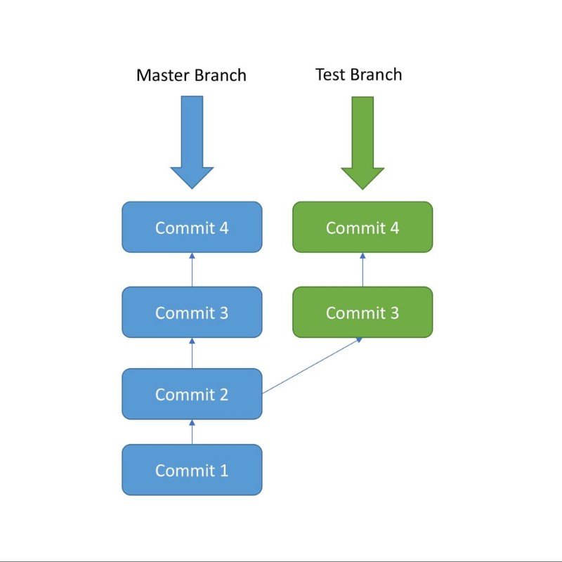
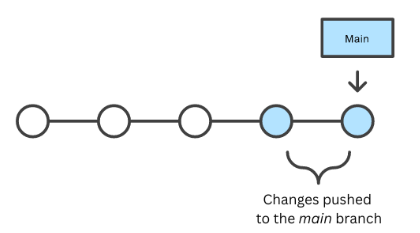
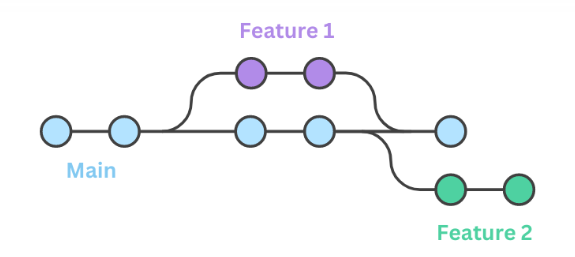
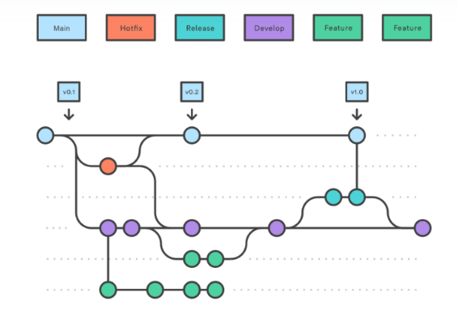
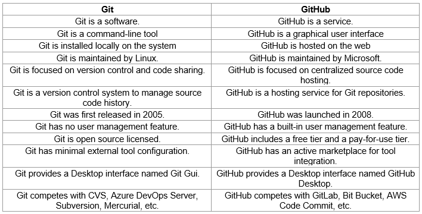
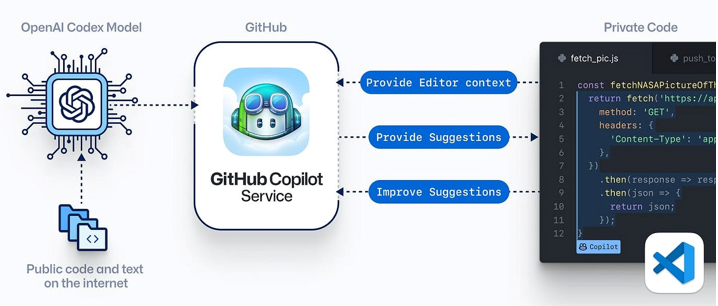

# Ansible Installation and Initial Setup 

1. [What, Why and How of Git](#What-Why-and-How-of-Git)
2. [Lifecycle](#Lifecycle)
3. [Git Branching](#Git-Branching)
4. [Merging and Conflict Resolution](#Merging-and-Conflict-Resolution)
5. [Github Overview](#Github-Overview)
6. [Git remote SSH](#Git-remote-SSH)
7. [Github Features](#Github-features)
8. [Github Co-pilot and Functions](#Github-Co-pilot-and-Functions)

---
&nbsp;
&nbsp;


## What, Why and How of Git

### What is Git?

Certainly! Git is a version control system that helps you track changes in your code and collaborate with others efficiently. Let's break down the "what, why, and how" of Git.
Git is a DevOps tool used for source code management. It is a free and open-source version control system used to handle small to very large projects efficiently. Git is used to tracking changes in the source code, enabling multiple developers to work together on non-linear development.

So Git is a distributed version control system. It is a tool that helps you manage and track changes in your codebase. With Git, you can:

- **Track Changes**: Git allows you to keep a history of changes made to your code, recording each modification, addition, or deletion.
- **Collaborate**: Git enables multiple people to work on the same project simultaneously, without interfering with each other's work.
- **Branching**: Git allows you to create branches, which are like separate workspaces. This helps you develop new features or fix bugs without affecting the main project until you're ready.
- **Merging**: Git makes it easy to merge changes from different branches back into the main project.

&nbsp;

### Why use Git?

Git was created by Linus Torvalds in 2005 to address specific challenges in managing the development of the Linux kernel. The key reasons for creating Git include:

1. **Distributed Version Control:** Unlike centralized version control systems, Git is distributed, allowing each user to have a complete local copy of the repository. This decentralization enhances collaboration and provides flexibility in development workflows.

2. **Speed and Performance:** Git is designed to be fast and efficient, allowing for quick branching, merging, and version tracking. This speed is crucial for large projects like the Linux kernel.

3. **Data Integrity:** Git uses a cryptographic hash function to ensure the integrity of the data. Every change and file is checksummed, making it highly resistant to corruption.

4. **Branching and Merging:** Git provides powerful branching and merging capabilities, enabling developers to work on different features or bug fixes simultaneously without conflicts. Merging changes back into the main codebase is made easier.

5. **Open Source Collaboration:** Git facilitates collaboration in open source projects by making it easier for developers worldwide to contribute, clone repositories, and propose changes through pull requests.

6. **Offline Capabilities:** Since developers have a complete copy of the repository on their local machines, Git allows them to work offline and commit changes locally. This is particularly beneficial for developers who may not always have a reliable internet connection.

7. **Flexibility:** Git is not tied to a specific workflow and can adapt to various development methodologies. This flexibility has contributed to its widespread adoption in diverse software development projects.

In summary, Git was created to provide a robust, distributed version control system that addresses the specific needs of large and collaborative software development projects, with a focus on speed, data integrity, and flexibility.


&nbsp;


## Lifecyle

Let;s get started on using Git:

### Download git

This link has details on how to install Git in multiple operating systems:
https://git-scm.com/book/en/v2/Getting-Started-Installing-Git

Verify if Git is installed by using the following command in the command prompt:

```bash
 git --version
 ```

Now it's time to create local Git Repository:

In your computer, create a folder for your project. Let's call this project folder "Test"

Go into this project folder, right click within the folder and select '''Open Git bash here" and add a local Git repository to the project using the following command.

```bash
git init
```

The ```git init``` command adds a local Git repository to the project, we also call it initialization of a Git repo.

### Staging and Committing the code


Committing is the process in which the code is added to the ***local repository***. Before committing the code, it has to be in the ***staging area***. The staging area is there to keep track of all the files which are to be committed.

Any file which is not added to the staging area will not be committed. This gives the developer control over which files need to be committed.

**Staging**

Use the following command for staging the file:

```bash
git add demo.txt
```
```
In case you want to add multiple files you can use:

```bash
git add file1 file2 file3
```

If you want to add all the files inside your project folder to the staging area, use the following command:

```bash
git add .
```

Use this carefully since it adds all the files and folders in your project to the staging area.


**Committing**
Use the following command to commit the file:

```bash
git commit -m "Initial Commit"
```

“Initial Commit” is the commit message here. Enter a relevant commit message to indicate what code changes were done in that particular commit.

### Git Status and Git Log

Now modify the ```demo.txt``` file and add the following snippet:

```bash 
Initial Content Adding more Content
```

**Status**

Use ```git status``` to find out information regarding what files are modified and what files are there in the staging area — it shows other information as well, which we can ignore for now.

Use the following command to see the status:

```bash
git status
```

The status shows that ```demo.txt``` is modified and is not yet in the staging area.

Now let us add ```demo.txt``` to the staging area and commit it using the following commands:

```bash
git add demo.txt git commit -m "demo.txt file is modified"
```

**Log**

Use ```git log``` to print out all the commits which have been done up until now.

The command used for this is:
```bash
git log
```

The log shows the author of each commit, the date of the commit, and the commit message.


## Git Branching

Up until now we have not created any branch in Git. By default, Git commits go into the master branch.

### What is a branch?

A branch is nothing but a pointer to the latest commit in the Git repository. So currently our master branch is a pointer to the second commit “demo.txt file is modified”.

**Why are multiple branches needed?**

Multiple branches are needed to support multiple parallel developments. Refer the image below to see how branches work.





Initially, commit 1 and commit 2 were done in the master branch. After commit 2 a new Branch called as “Test” is created, and commit 3 and commit 4 are added to the test branch.

At the same time, a different commit 3 and commit 4 are added to the master branch. Here we can see that after Commit 2, two parallel developments are being done in 2 separate branches.

The Test Branch and the Master Branch have diverged here and have different code — the code from Test Branch can be merged with the Master branch using ```git merge```. This will be covered later.

**Create a New Branch in Local**

Create a new branch called test using the following command:

```bash
git branch test
```
This command creates the ```test``` branch.


We are still in the context of the master branch. In order to switch to the ```test``` branch. use the following command:

```bash
git checkout test
```

Now we are in the ```test``` branch.

You can list out all the branches in local using the following command:

```bash
git branch
```

**Do Some Commits in the New Branch**

Modify ```demo.txt``` by adding the following snippet:

```bash
Initial Content Adding more Content Adding some Content from test Branch
```

Now stage and commit using the following commands:

```bash
git add demo.txt git commit -m "Test Branch Commit"
```

This commit was done in the Test Branch, and now Test Branch is ahead of Master Branch by 1 commit — as the test branch also includes the 2 commits from the master branch.

You can verify the commit history in Test Branch using:

```bash
git log
```


So in essence, Git branching strategy allows developers to collaborate on a project while also tracking changes and maintaining multiple versions. 

### Branching Strategies

There are several Git branching strategies available, i.e. Trunk-Based Development, Feature Branching, Git Flow each with its own set of advantages and disadvantages. The best strategy is determined by the project’s and team’s unique requirements. We’ll go over three popular Git branching strategies:

1. Trunk-based Development Branching

Trunk-Based Development is a Git branching strategy that emphasizes frequent integration and testing on the main branch to ensure a high level of collaboration and continuous delivery.

&nbsp;



&nbsp;

2. Feature Branching

Feature Branching is a Git branching strategy that involves creating separate branches for individual features or changes to allow for isolation, testing, and review before merging into the main branch.

&nbsp;



&nbsp;


3. Git Flow Branching

Git Flow is a Git branching model that builds on Feature Branching by adding additional branches for managing releases and hotfixes, providing a structured approach for managing different types of changes in larger teams or more complex projects.

&nbsp;



&nbsp;

## Merging and Conflict Resolution

> work in progress


## Github Overview

> work in progress

### Git vs Github




## Git remote SSH 

### about remote repositories

A remote URL is Git's fancy way of saying "the place where your code is stored." That URL could be your repository on GitHub, or another user's fork, or even on a completely different server.

You can only push to two types of URL addresses:

- An HTTPS URL like https://github.com/user/repo.git
- An SSH URL, like git@github.com:user/repo.git

Git associates a remote URL with a name, and your default remote is usually called origin.

### Creating remote repositories

You can use the ```git remote add``` command to match a remote URL with a name. For example, you'd type the following in the command line:


```bash
git remote add origin <REMOTE_URL>
```

This associates the name <mark>origin</mark> with the <mark>REMOTE_URL</mark>.


### Cloning with HTTPS URLs

The <mark>https://</mark> clone URLs are available on all repositories, regardless of visibility. <mark>https://</mark> clone URLs work even if you are behind a firewall or proxy.

When you <mark>git clone</mark>, <mark>git fetch</mark>, <mark>git pull</mark>, or <mark>git push</mark> to a remote repository using HTTPS URLs on the command line, Git will ask for your GitHub username and password. When Git prompts you for your password, enter your personal access token. Alternatively, you can use a credential helper like [Git Credential Manager](https://github.com/git-ecosystem/git-credential-manager/blob/main/README.md). Password-based authentication for Git has been removed in favor of more secure authentication methods. For more information, see "Managing your personal access tokens."

### Cloning with SSH URLs

SSH URLs provide access to a Git repository via SSH, a secure protocol. To use these URLs, you must generate an SSH keypair on your computer and add the public key to your account on GitHub.com. For more information, see "[Connecting to GitHub with SSH](https://docs.github.com/en/authentication/connecting-to-github-with-ssh)."


When you <mark>git clone</mark>, <mark>git fetch</mark>, <mark>git pull</mark>, or <mark>git push</mark> to a remote repository using SSH URLs, you'll be prompted for a password and must provide your SSH key passphrase. For more information, see "[Working with SSH key passphrases](https://docs.github.com/en/authentication/connecting-to-github-with-ssh/working-with-ssh-key-passphrases)."


## Github Features

> work in progress

## Github Copilot

### Copilot

GitHub Copilot is an AI pair programmer. You can use GitHub Copilot to get suggestions for whole lines or entire functions right inside your editor.



It can suggest complete lines of code or entire functions by analysing how you code. GitHub Copilot can assemble code from user comments and predicts your code by just reading the function name you have declared. It allows you to cycle through alternative suggestions and manually edit the suggested code. It autofill repetitive code, or create unit tests for your methods.


The GitHub Copilot editor extension sends your comments and code to the GitHub Copilot service, which then uses OpenAI Codex to synthesize and suggest code. it actually works by reading through all the open-source code on the GitHub repos worldwide and then collect the data and tries to find the best possible code related to it! It is said to work great with repetitive code patterns so users can let it generate the rest of the code. The AI assistant can also help you learn a new programming language.


### GitHub Copilot Working:


1. **AI Model:**
GitHub Copilot is powered by Codex, a language model based on OpenAI's GPT-3 architecture. Codex has been trained on a diverse range of publicly available code from various programming languages.

2. **Integration:**
It is integrated into Visual Studio Code, a popular source-code editor, making it accessible to a broad community of developers.

3. **Code Suggestions:**
GitHub Copilot offers real-time code suggestions as developers’ type. It provides completions for entire lines or blocks of code, aiming to predict what the developer intends to write based on the context of the code.

4. **Multilingual Support:**
GitHub Copilot supports multiple programming languages, allowing developers to work in languages like Python, JavaScript, TypeScript, Java, C++, and more

5. **Learning from Context:**
The tool learns from the context of the code being written and from the patterns it has identified in the large dataset it was trained on. It adapts to the specific coding style and preferences of the developer

6. **User Feedback:**
GitHub Copilot encourages developers to provide feedback on its suggestions. Users can submit feedback about the accuracy and usefulness of the suggested code, helping improve the model over time


### Benefits:

1. **Productivity:**
GitHub Copilot aims to boost developer productivity by reducing the time spent on routine coding tasks. It can generate boilerplate code and handle repetitive sections, allowing developers to focus on more complex and creative aspects of their work

2. **Learning Aid:**
It serves as a learning aid, helping developers understand different coding patterns and styles. Developers can learn from the suggestions and gain insights into best practices

3. **Efficient Collaboration:**
GitHub Copilot can facilitate collaboration by providing consistent code suggestions across a team. This can lead to more standardized and maintainable codebases


### Concerns and Considerations:

1. **Accuracy:**
While GitHub Copilot is powerful, it might not always provide accurate or secure code. Developers need to review and test the suggestions thoroughly

2. **License and Copyright Issues:**
Developers should be mindful of licensing and copyright issues when using code suggestions from GitHub Copilot, as the generated code might be based on various open-source projects

3. **Dependency on Internet Connection:**
GitHub Copilot relies on an internet connection to access the Codex model, which could be a consideration for developers working in environments with restricted internet access

GitHub Copilot has generated significant interest in the developer community due to its potential to reshape coding workflows. However, developers should use it judiciously and be aware of its capabilities and limitations


## Github Functions

> work in progress


&nbsp;

---
&nbsp;
## Next topic: Ansible Playbooks