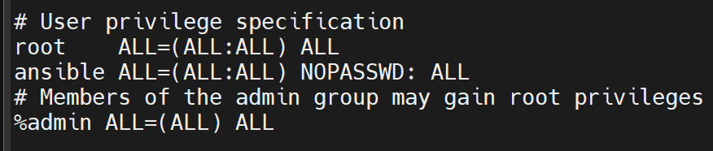
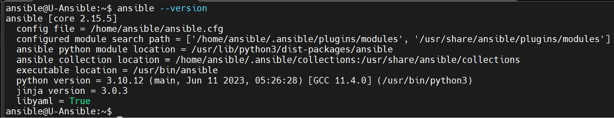
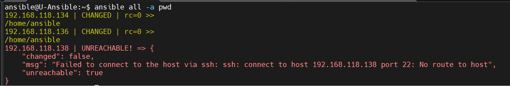
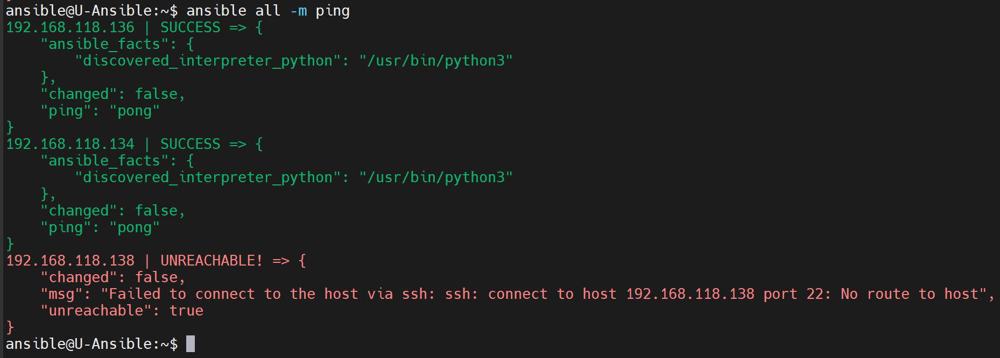

# Ansible Installation and Initial Setup 

1. [Setting up controller server for Ansible installation](#setting-up-controller-server-for-ansible-installation)
2. [Installing Ansible](#install-ansible)
3. [Configure Ansible](#configure-ansible)
4. [Creating Inventory](#creating-inventory)
5. [Configure SSH for Ansible](#configure-ssh-for-ansible)
6. [Generate SSH Key](#generate-ssh-key)
7. [Prepare Ansible Hosts](#prepare-ansible-hosts)
8. [Push SSH key from Controller to Hosts](#push-ssh-key-from-controller-to-hosts)
9. [Run Ansible tests](#run-ansible-tests)

---
&nbsp;
&nbsp;


## Setting up Controller Server for Ansible installation

&nbsp;

**Setting up Ubuntu machine**

Please make sure SSH is installed and running on the machine we are setting up as Ansible Controller, if not, install SSH service using the following commands:

```bash
sudo apt update
sudo apt upgrade
sudo apt install ssh
sudo systemctl enable ssh
sudo systemctl start ssh
```


### First create a user named Ansible
```bash
sudo addusr ansible
```
### Give Ansible user SUDO rights

edit /etc/sudoers file to add Ansible user with password-less sudo priviliges

```bash
sudo nano /etc/sudoers
```

Add  ``` ansible ALL=(ALL:ALL) NOPASSWD: ALL ``` to the file, it should look like below:

**Output**




---

&nbsp;

## Install Ansible

&nbsp;

Install Ansible on Ubuntu using ansible user:


```bash
sudo su ansible
sudo apt update
sudo apt install software-properties-common
sudo add-apt-repository --yes --update ppa:ansible/ansible
sudo apt install ansible
```
Checking Ansible installation and its configuration:

```bash
ansible --version
```


---

&nbsp;

## Configure Ansible


By default the sample confi file is ``` etc/ansible/ansible.cfg ``` and has not much configuration, so we need to initiate it by running the following command:

```bash
ansible-config init --disabled -t all > ansible.cfg
```

Now if you run ``` ansible --version ``` it should show you the changed location of config file which has more detailed configuration options:

**Output**



---

&nbsp;
## Creating Inventory

Adding Hosts to Ansible Inventory file, you need to edit ``` /etc/ansible/hosts ``` file.

```bash
sudo nano /etc/ansible/hosts
```

Here you need to define a group and add IP addresses of the hosts to each group, in my case I added two groups with some hosts based on their OS:

```bash
[unix]
192.168.118.134
192.168.118.136

[win]
192.168.118.138
```
---
&nbsp;
## Configure SSH for Ansible

Now its time to setup your SSH so that Ansible can use it to reach your hosts, with privilage access and using public key.

To do it, we need to edit ``` /etc/ssh/sshd.config``` file to enable the following settings:


```bash
PermitRootLogin yes

PasswordAuthentication yes
```

One done, restart the SSH service using ``` sudo systemctl restart ssh```

---
&nbsp;
## Generate SSH Key

To ensure Ansible will not require to provide password everytime it reaches hosts, we need to create a public key and copy it to all hosts.

First generate key:

```bash 
ssh-keygen 
```
> It is ideal not to change the location of the key, and do not provide any passphrase while generating the key.
> 

---
&nbsp;
## Prepare Ansible Hosts


Before we share the key to our hosts, we need to make sure the SSH configration is also done the same way as we did on our Ansible server. Please perform the following on each host OS:


1. [Create Ansible user](#first-create-a-user-named-ansible)
1. [Give Ansible user SUDO rights](#give-ansible-user-sudo-rights)
3. [Configure SSH for Ansible on Hosts](#configure-ssh-for-ansible)


---
&nbsp;
## Push SSH key from Controller to Hosts

Now, we need to push the public key generated on Ansible Controller server to our Linux based hosts:

Syntex: ```ssh-copy-id username@hostIPAddress```

In our case, the username should be **ansible** 

```bash
ssh-copy-id ansible@192.168.113.134
```
Enter yes for confirmation. Once the key is copied to the host, you can check if host should not ask for any password while accessing it over SSH from Ansible Controller server:

```bash
ssh ansible@192.168.113.134
```

Repeat the same action for all Linux based hosts, one by one and verify.


---
&nbsp;
## Run Ansible tests

Congratulations! we have now setup our Ansible environment. It is time to test if everything is working based on our configuration.

To test, we can run some simple commands using Ansible to check if the hosts are reachable, and responding to our commands:

```bash
ansible all -a pwd
```
**Output**




```bash
ansible all -m ping
```

**Output**



> Note: since my Windows host is not configured, it shows error.


---
&nbsp;
## Next topic: Ansible Playbooks