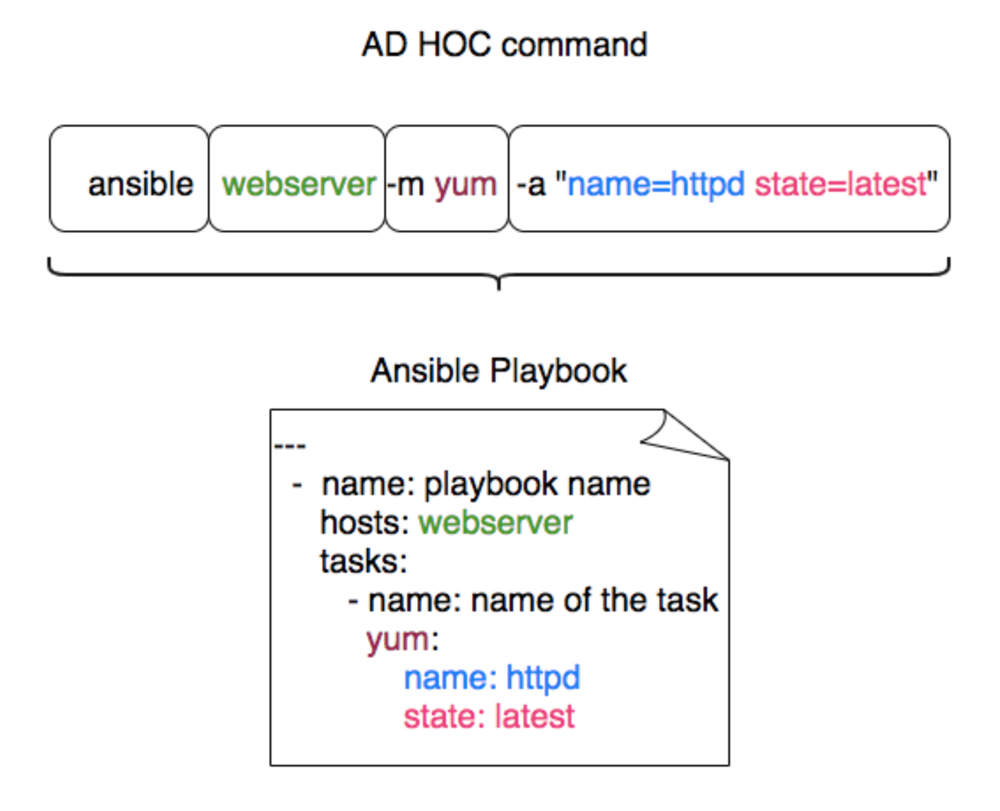
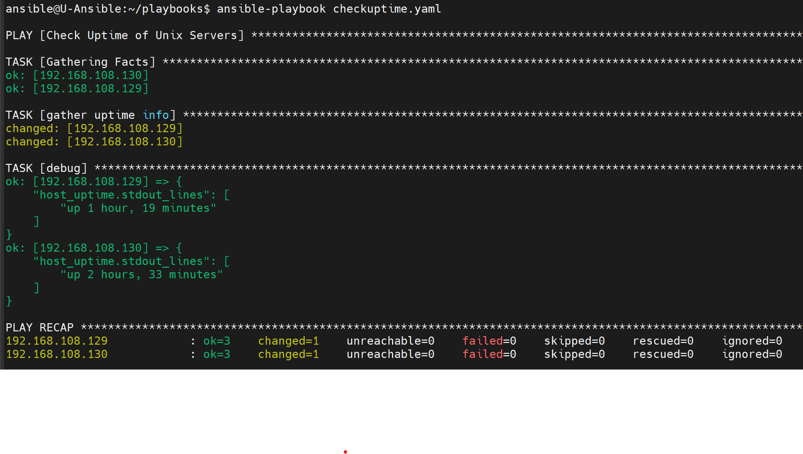
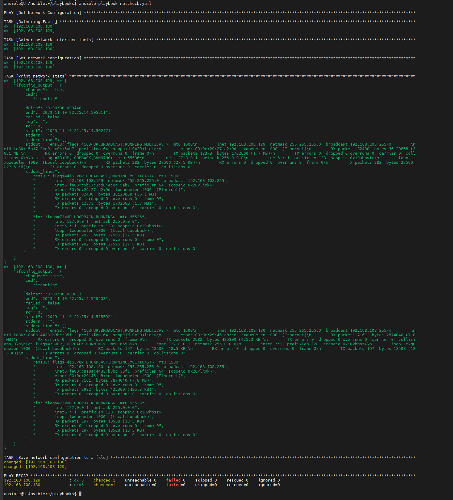
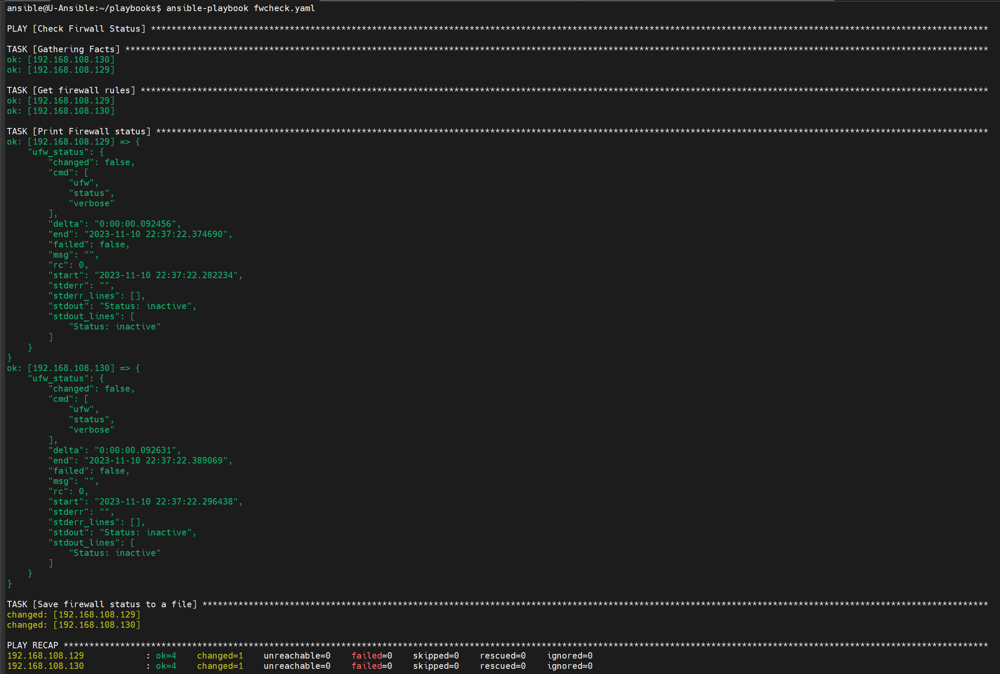
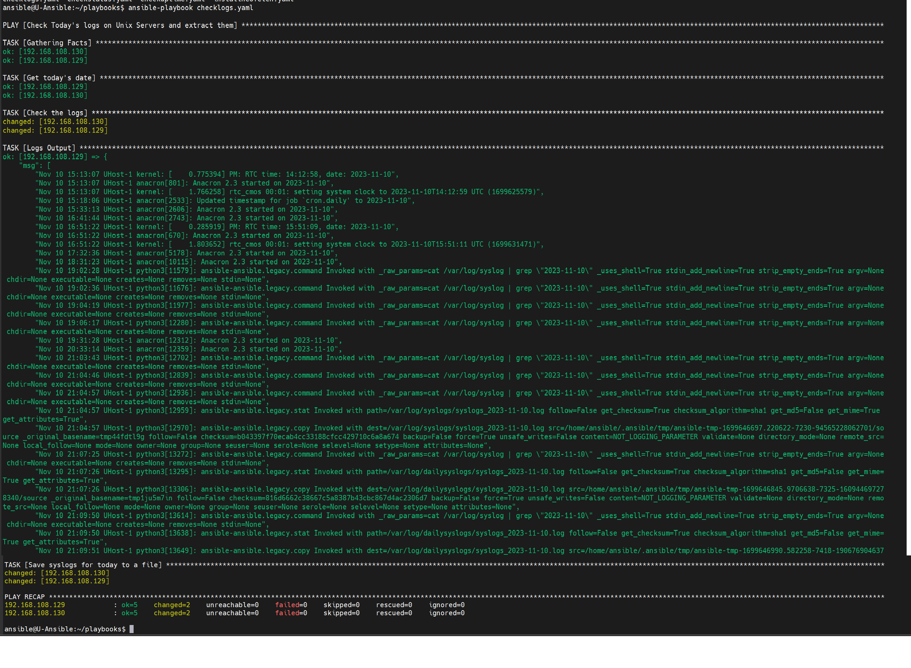
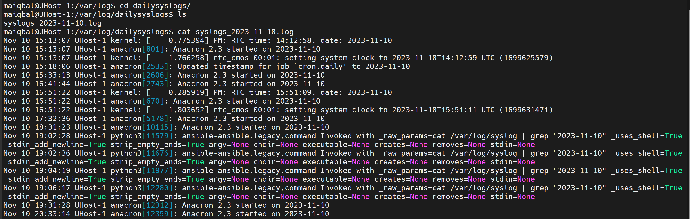
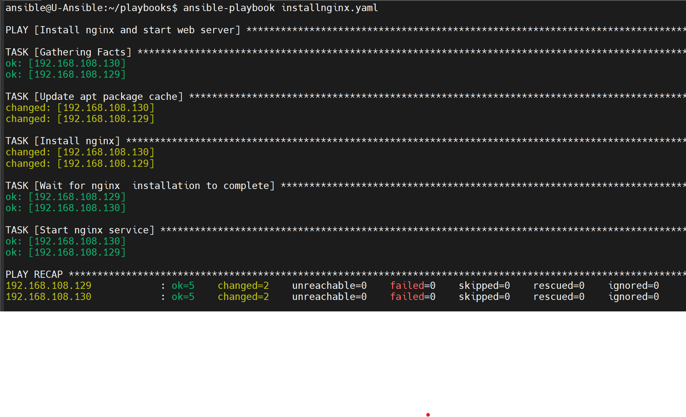
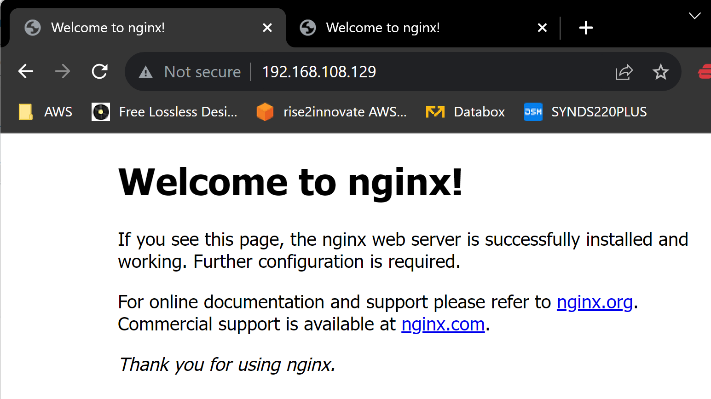
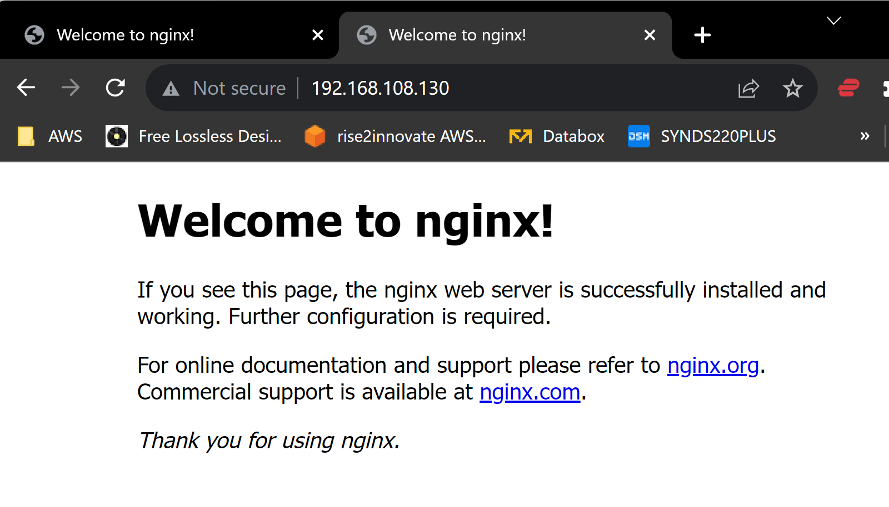

# Ansible Play and Playbooks

1. [What is Ansible Playbook?](#what-is-ansible-playbook)
2. [Ansible Play vs Playbook](#ansible-play-vs-playbook)
3. [How to execute a Playbook?](#how-to-execute-a-playbook)
4. [How to Dry Run the Playbook?](#how-to-dry-run-the-playbook)
5. [Syntax Check](#syntax-check)
6. [How to use Variables?](#how-to-use-variables)
7. [5 daily life Playbooks for Sys Admins](#5-daily-life-playbooks-for-sys-admins)
8. [Ansible Conditions](#ansible-conditions)


---
&nbsp;
&nbsp;


## What is Ansible Playbook?

It is a metaphor representing the configuration files of Ansible.  It contains a list of tasks  (plays) in an order they should get executed against a set of hosts or a single host based on the configuration specified.  Playbooks are written in YAML, in an easy human readable syntax.

>
Consider ansible ad-hoc commands as **bash commands** and a playbook as a **bash script**
>

Ansible Playbooks are a group of ad-hoc commands with additional programming elements like loops, iterations, conditionals etc.

Simply put, If Ansible modules are the tools in your workshop, playbooks are your instruction manuals, and your inventory of hosts are your raw material.

If ansible ad hoc is suitable for quick and single task (or) Purpose,  ansible playbooks are ideal for projects and automation.

In a single playbook, you can see multiple modules and handlers are organized. In other words, this is called as Orchestration.




**Example Playbook:**

```yaml
---
  - name: Playbook
    hosts: webservers
    become: yes
    become_user: root
    tasks:
      - name: ensure apache is at the latest version
        yum:
          name: httpd
          state: latest
      - name: ensure apache is running
        service:
          name: httpd
          state: started
```

&nbsp;

## Ansible Play vs Playbook

To understand the ansible-playbook you have to understand the Ansible Adhoc commands.

Ad hoc commands can run a single, simple task against a set of targeted hosts as a one-time command. The real power of Ansible, however, is in learning how to use playbooks to run multiple, complex tasks against a set of targeted hosts in an easily repeatable manner.

Here is something to take away

>
>**A play** is an ordered set of tasks which should be run against hosts selected from your inventory.
>
>**A playbook** is a text file that contains a list of one or more plays to run in order.
>

In the previously given example, you can see we are running all the tasks against a single host group named webservers  this is called A PLAY.

If I want to run a different set of tasks against different host group. All you need to do is add one more PLAY.

Remember: A Playbook can have many plays destined to run against a different set of host groups

Every Play must contain

- A set of hosts to configure
- A list of tasks to be executed on those hosts

Think of a play as a wire that connects hosts to tasks.

&nbsp;

## How to execute a Playbook?

Ansible playbook can be executed with ansible-playbook command. like you have ansible command to execute ad hoc command. This is dedicated for ansible playbooks.

&nbsp;

## How to Dry Run the Playbook?


you can actually run the playbook with Dry Run feature to see what changes would be made to the server without having to perform the actual changes.

to do that. you just have to add --check at the end of your your ansible-playbook startup command

**Example:**

```bash
ansible-playbook netstatus.yaml --check
```


&nbsp;

## Syntax Check

If you quickly want to verify if everything is ok with the playbook. You can perform a Syntax check.

Here is the ansible command line example on how to perform Syntax check on ansible playbook. Refer the video for the practical idea.

```bash
ansible-playbook – syntax-check sampleplaybook.yml -i ansible_hosts
```

&nbsp;
## 5 How to use Ansible Variables?

Ansible playbook supports defining the variable in two forms, Either as a separate file with full of variables and values like a properties file. or a Single liner variable declaration like we do in any common programming languages

```bash vars ``` to define inline variables within the playbook

```bash vars_files ``` to import files with variables

Let's suppose we want to add a few variables for our webserver like the server name and SSL key file and cert file etc.

it can be done with vars like this

```yaml
---
  - name: Playbook
    hosts: webservers
    become: yes
    become_user: root
    vars:
       key_file:  /etc/apache2/ssl/mywebsite.key
       cert_file: /etc/apache2/ssl/mywebsite.cert
       server_name: www.mywebsite.com
    tasks:
      - name: ensure apache is at the latest version
        yum:
          name: httpd
          state: latest
      ### SOME MORE TASKS WOULD COME HERE ###
      # you can refer the variable you have defined earlier like this #
      # "{{key_file}}"  (or) "{{cert_file}}" (or) "{{server_name}}" #
      ##
      - name: ensure apache is running
        service:
          name: httpd
          state: started
```

If you want to keep the variables in a separate file and import it with vars_files

You have to first save the variables and values in the same format you have written in the playbook and the file can later be imported using vars_files like this:

```yaml
---
  - name: Playbook
    hosts: webservers
    become: yes
    become_user: root
    vars_files:
        - apacheconf.yml
    tasks:
      - name: ensure apache is at the latest version
        yum:
          name: httpd
          state: latest
      ### SOME MORE TASKS WOULD COME HERE ###
      # you can refer the variable you have defined earlier like this #
      # "{{key_file}}"  (or) "{{cert_file}}" (or) "{{server_name}}" #
      ##
      - name: ensure apache is running
        service:
          name: httpd
          state: started
```

the content of the apacheconf.yml would like like this:

```bash
key_file: /etc/apache2/ssl/mywebsite.key  
cert_file: /etc/apache2/ssl/mywebsite.cert  
server_name: www.mywebsite.com
```

to keep things cleaner and to keep your playbook simple, It is recommended to use separate variable files and when you are creating ansible roles, you would have to use the variable files more than defining it inline.

&nbsp;
## 5 daily life Playbooks for Sys Admins

### Check Servers Uptime

&nbsp;

```yaml
---
  - name: Check Uptime of Unix Servers
    hosts: unix
    tasks:
    - name: gather uptime info
      shell: uptime -p
      register: host_uptime

    - debug:
         var: host_uptime.stdout_lines

```

**Output**




&nbsp;

### Check Network Interfaces on remote hosts

&nbsp;

```yaml
---
- name: Get Network Configuration
  hosts: unix
  become: true

  tasks:
    - name: Gather network interface facts
      ansible.builtin.gather_facts:
        gather_subset: network

    - name: Get network configuration
      command: ifconfig
      register: ifconfig_output
      changed_when: false

    - name: Print network stats
      debug:
        var: ifconfig_output

    - name: Save network configuration to a file
      copy:
        content: "{{ ifconfig_output }}"
        dest: "/tmp/network_config.txt"
      when: ifconfig_output.stdout is not search('Device not found')
```

**Output**

Ansible Run:


&nbsp;

### Check Firwall status on Servers

&nbsp;


```yaml
---
- name: Check Firwall Status
  hosts: unix
  become: true

  tasks:
    - name: Get firewall rules
      command: ufw status verbose
      register: ufw_status
      changed_when: false

    - name: Print Firewall status
      debug:
        var: ufw_status

    - name: Save firewall status to a file
      copy:
        content: "{{ ufw_status.stdout }}"
        dest: "/tmp/ufw_status.txt"
      when: ufw_status.stdout is not search('not found')
```

**Output**

Ansible Run:


&nbsp;

### Check Servers logs for TODAY

&nbsp;

```yaml
---
  - name: Check Today's logs on Unix Servers and extract them
    hosts: unix
    tasks:
    - name: Get today's date
      set_fact:
        today_date: "{{ ansible_date_time.date }}"

    - name: Check the logs
      shell: cat /var/log/syslog | grep "{{ today_date }}"
      become: yes
      register: log_messages
      ignore_errors: true

    - name: Logs Output
      debug: msg={{ log_messages.stdout_lines }}
      changed_when: false
      ignore_errors: true

    - name: Save syslogs for today to a file
      copy:
        content: "{{ log_messages.stdout_lines | join('\n') }}"
        dest: "/var/log/dailysyslogs/syslogs_{{ today_date }}.log"
      when: log_messages.stdout_lines | length > 0
```

**Output**

Ansible Run:


Daily syslogs output:


&nbsp;

### Install Web Server and Run it.

&nbsp;

```yaml
---
  - name: Install nginx and start web server
  hosts: unix
  become: true

  vars:
    install_wait_time: 30  # Adjust the wait time as needed

  tasks:
    - name: Update apt package cache
      become: true
      apt:
        update_cache: yes

    - name: Install nginx
      become: true
      apt:
        name: nginx
        state: present

    - name: Wait for nginx  installation to complete
      become: true
      wait_for:
        timeout: "{{ install_wait_time }}"
        state: started

    - name: Start nginx service
      become: true
      service:
        name: nginx
        state: started

```

**Output**

Ansible Run:


&nbsp;

nginx running:



&nbsp;



&nbsp;

&nbsp;

## Ansible Conditions


---
&nbsp;
## Previous topic: [Ansible Installation](https://github.com/rise2innovate/DevOps/blob/main/03-Ansible/Assignments/01-%20Ansible%20Installation%20and%20Initial%20Setup.md)   |   Next topic: Ansible Governance